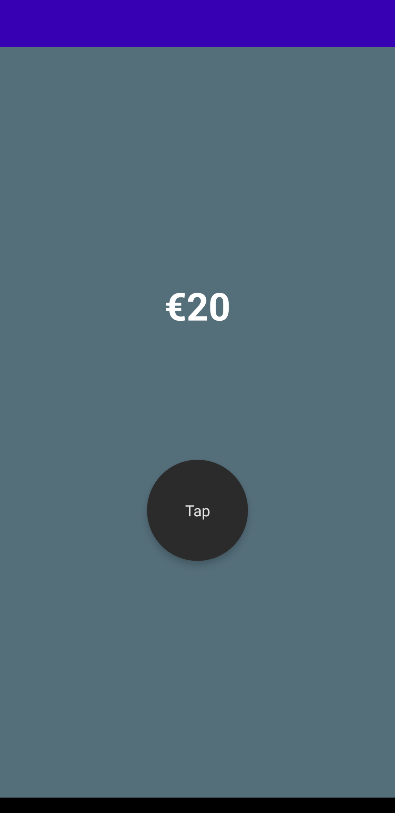
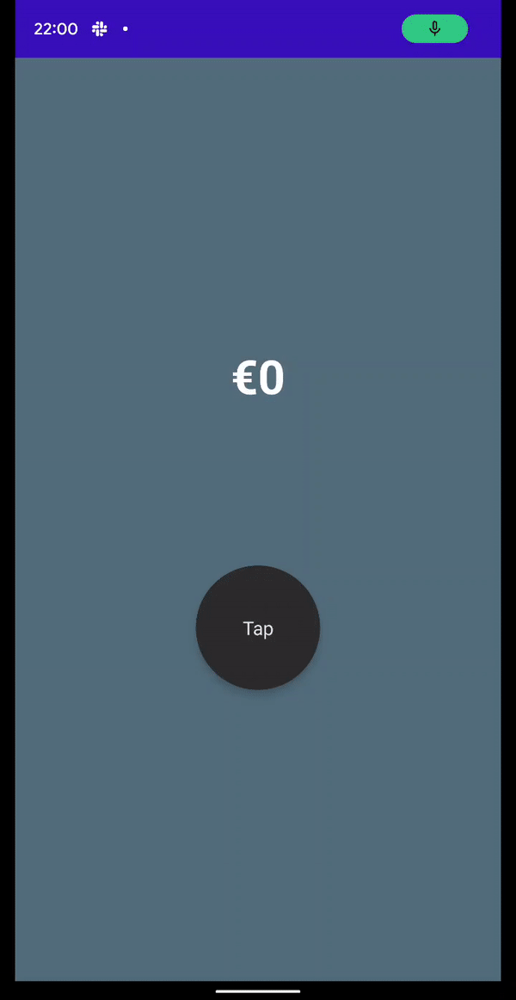

Money Counter App from Udemy Course

- Uses Spacer to create space between widgets
- Contains making widget clickable
- User Surface, Column and Box to layout widget 
- Uses state in compose to listen for update in data and recompose UI
- Uses modifiers to customise widgets

     
    

